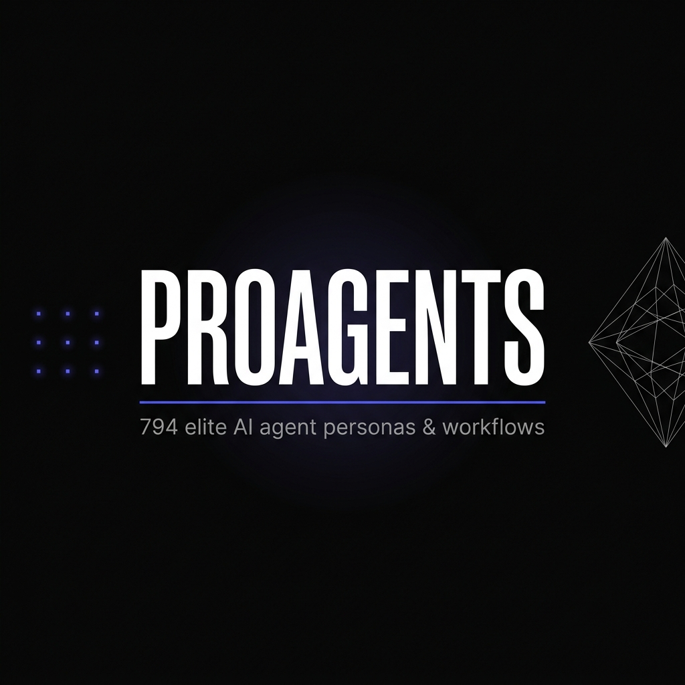

<p align="center">
  
</p>

<p align="center">
  <a href="README.md">English</a> · <a href="README.ru.md">Русский</a> · <b>简体中文</b>
</p>

<p align="center">
  
  
  
  
</p>

---

**proagents** 是一个精心策划的提示词库，包含 **794 个专业系统提示词、智能体角色和任务工作流**，从 6 个顶级开源 Agent 框架中提炼而来。无依赖，无遥测，纯 Markdown。

---

## 📊 核心数字

<table>
<tr>
<td align="center"><b>794</b><br><sub>提示词总量</sub></td>
<td align="center"><b>232</b><br><sub>智能体角色</sub></td>
<td align="center"><b>521</b><br><sub>工作流清单</sub></td>
<td align="center"><b>41</b><br><sub>规则与风格令牌</sub></td>
<td align="center"><b>11</b><br><sub>覆盖领域</sub></td>
<td align="center"><b>6</b><br><sub>来源框架</sub></td>
</tr>
</table>

---

## ⚡ 为什么选择 proagents？

| 维度 | 普通 AI 输出 | proagents 增强输出 |
|---|---|---|
| **UI 视觉** | 泛泛的 Tailwind 样式，系统默认字体 | HSL 调色板、微动画、磨砂玻璃效果 |
| **代码安全** | 硬编码、遗漏边界情况 | 严格验证、具体类型错误处理 |
| **测试规范** | "之后再补测试" | TDD 优先：红→绿→重构 |
| **性能优化** | 重复渲染、未压缩资源 | LCP 目标、弹簧物理动画 |

---

## 🚀 快速开始

```bash
git clone https://github.com/Arlandaren/proagents.git
cd proagents

./proagents list                                          # 查看所有领域
./proagents search react                                  # 关键词搜索
./proagents install react-patterns --cursor              # → .cursor/rules/
./proagents install senior-fullstack --stdout >> CLAUDE.md
```

无需 pip 安装，支持 Python 3.8+。

---

## 🗂️ 领域概览

### 🧑‍💻 工程类角色 — 126 个智能体

| 智能体 | 功能说明 |
|---|---|
| `senior-fullstack` | 具备严格架构原则和代码审查标准的全栈工程师 |
| `react-build-resolver` | 诊断并修复 React/Next.js 的 Webpack/Vite 构建问题 |
| `solidity-smart-contract-engineer` | EVM 合约、Gas 优化、DeFi 协议安全 |
| `sre-site-reliability-engineer` | SLO、错误预算、混沌工程、减少重复劳动 |
| `embedded-firmware-engineer` | ESP32、STM32、Nordic nRF 的裸机/RTOS 开发 |
| `godot-multiplayer-engineer` | Godot 4 的 MultiplayerAPI、ENet/WebRTC、RPC |
| `unity-architect` | ScriptableObject、数据驱动模块化、ECS/DOTS |
| `macos-spatial-metal-engineer` | Swift + Metal 高性能 3D 渲染，Vision Pro 开发 |
| `+ 118 个其他` | AI/ML、后端、DevOps、游戏引擎、XR、区块链... |

### 🎨 设计类角色 — 15 个智能体

| 智能体 | 功能说明 |
|---|---|
| `design-ui-designer` | 视觉设计系统、组件库、品牌一致性 |
| `design-ux-architect` | CSS 架构、无障碍布局、实施指引 |
| `design-brand-guardian` | 品牌声调、视觉标识保护、定位维护 |
| `design-image-prompt-engineer` | 适用于 Midjourney、DALL·E、SD 的精准提示词 |
| `+ 11 个其他` | 动效设计师、包容性视觉专家、UX 研究员... |

### ⚙️ 运营类角色 — 33 个智能体

| 智能体 | 功能说明 |
|---|---|
| `code-reviewer` | 以正确性和安全性为核心的建设性代码审查 |
| `react-reviewer` | React 模式、Hooks 规范、渲染性能 |
| `typescript-reviewer` | 严格类型安全、接口契约、类型推导质量 |
| `database-reviewer` | Schema 设计、索引策略、N+1 检测 |
| `+ 29 个其他` | Go、Python、Java、C#、C++ 审查员 + PM 角色... |

### 💼 商业战略 — 14 个智能体

| 智能体 | 功能说明 |
|---|---|
| `chief-of-staff` | 为管理者过滤噪音、管理流程、路由决策 |
| `executive-brief` | 使用 McKinsey SCQA + BCG Pyramid 生成高管摘要 |
| `feedback-synthesizer` | 将原始用户反馈转化为量化的产品优先级 |
| `government-digital-presales-consultant` | 政府数字化项目预售、政策解读、投标文件 |
| `+ 10 个其他` | GTM 策划师、趋势研究员、提案策略师... |

### 🔬 专业领域 — 44 个智能体

法律科技、学术研究、金融、空间计算等垂直领域专家。

---

## 📋 工作流清单 — 521 个

### 🛠️ 开发类 — 363 个
`tdd-workflow` · `react-patterns` · `production-deployment` · `launch-strategy` · `stripe-integration-expert` · `liquid-glass-design` · `motion-advanced`

### 🔒 安全与合规 — 64 个
`owasp-threat-modeling` · `soc2-compliance` · `gdpr-privacy` · `ai-security` · `threat-detection`

### 🧪 QA 与测试 — 32 个
`react-testing` · `browser-qa-testing` · `ab-test-setup` · `accessibility` · `api-test-suite-builder`

### 📊 业务运营 — 62 个
`github-ops` · `analytics` · `board-deck-builder` · `research` · `senior-secops`

---

## 🎨 规则与风格令牌 — 41 个文件

`rules/taste/` 消除视觉平庸：
- `animate` — 弹簧物理动画，逐帧精准运动
- `brand` — HSL 色彩理论、自定义字体栈
- `liquid-glass` — 正确参数值的磨砂玻璃效果
- `overdrive` — 需要高端冲击感时的最大视觉密度

`rules/core/` — 零容忍代码规范：无魔法值，无硬编码密钥。

---

## ⚙️ IDE 集成

```bash
# Cursor
./proagents install react-patterns --cursor

# Claude Code
./proagents install code-reviewer --stdout >> CLAUDE.md

# Windsurf / Zed / Trae
./proagents install ux-architect --stdout
```

---

## ⚖️ 许可证

从 6 个开源框架整理而来，遵循 MIT 和 Apache 2.0 协议。  
原始署名信息完整保留在 [CREDITS.md](./CREDITS.md) 中。  
[MIT 许可证](LICENSE) © 2026 Arlandaren
