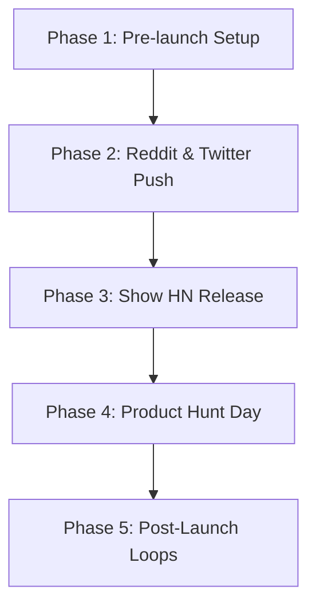

# proagents: Go-To-Market & Launch Playbook

This guide outlines the execution playbook to maximize GitHub stars and drive community engagement for the `proagents` release.

---

## 🎯 Launch Strategy Overview

To successfully launch an open-source prompt/agent library, the launch must be **value-first** and **developer-centric**. Developers are skeptical of "AI wrapper hype," but they love highly optimized, ready-to-use configurations and interactive terminal tools.



---

## 🚀 Phase 1: Pre-Launch Preparation

1. **Self-Checklist**:
   * Verify all 775 `.md` files contain valid YAML headers and no broken links.
   * Make sure `proagents.py` runs cleanly on Python 3.8+ without any third-party dependencies.
   * Link `README.md` to `assets/banner.png` correctly.

2. **The "Seeding" Star Count**:
   * GitHub algorithms prefer trending repos. Before launching on large platforms, secure **15-20 stars** from coworkers, developer friends, or private Telegram channels.
   * A repository with 0 stars gets significantly fewer clicks on Hacker News than one with 15 stars.

---

## 📢 Phase 2: Reddit & Hacker News Execution

### 1. Reddit Subreddits to Target
Post value-first descriptions showing the CLI tool in action. Avoid marketing speak.

* **`/r/ChatGPTCoding`** (150k+ members)
  * *Angle*: "I compiled and standardized 770+ professional system prompts and task checklists from elite agent repos into a single, clean domain-based directory with a zero-dep Python CLI to install them directly into `.cursorrules` or Claude Code."
* **`/r/LocalLLaMA`** (180k+ members)
  * *Angle*: "Great for local agents. Here are structured, TDD-focused prompt guidelines mapped into engineering/operations/taste domains."
* **`/r/selfhosted`** & **`/r/developer`**
  * *Angle*: "Stop copying prompts from medium posts. I created a clean, prefix-free registry of roles and system files for AI IDEs."

### 2. Hacker News (Show HN)
Hacker News requires strict, humble formatting. Keep the title descriptive.

* **Title**: `Show HN: Proagents – 770+ structured agent personas and task workflows`
* **First Comment**:
  ```text
  Hi HN!
  
  I was tired of copying and pasting messy, bloated prompts between Cursor, Claude Code, and Zed. 
  I merged and standardized files from 6 open-source agent repositories into a clean domain-oriented structure.
  
  What's inside:
  - 40+ rules for visual taste, styling, and typography.
  - 230+ agent personas (Engineering, Operations, Business, specialized fields).
  - 500+ structured checklists (TDD loops, GDPR audits, security threat modeling).
  - A zero-dependency Python script to install any prompt into your workspace with a single command.
  
  It's fully open-source (MIT/Apache 2.0). Hope this saves you time!
  ```

---

## 🏆 Phase 3: Product Hunt Launch

Product Hunt is ideal for visual appeal and general tech adoption.

1. **Visual Assets**:
   * Use the generated `assets/banner.png` as the main header.
   * Create 3-4 screenshots of the terminal output showing `python proagents.py search` and `python proagents.py install --cursor`.
2. **First Comment Playbook**:
   * Introduce the problem: "LLMs are incredibly smart, but default system prompts produce generic, low-quality code (slop)."
   * Explain the solution: "Proagents acts as a modular library of professional, field-tested rules."
3. **Launch Timing**:
   * Schedule the launch for **Tuesday at 12:01 AM PST**. This maximizes the voting window for the daily top chart.

---

## 🔄 Phase 4: Sustaining Momentum (Post-Launch)

1. **Comparison Pages**:
   * Add a `vs/` directory comparing default Cursor prompts vs. Proagents optimized system instructions.
2. **Weekly Updates**:
   * Push minor updates (e.g. adding 1-2 new agent roles) to keep the repository active in GitHub's "recently updated" feeds.
